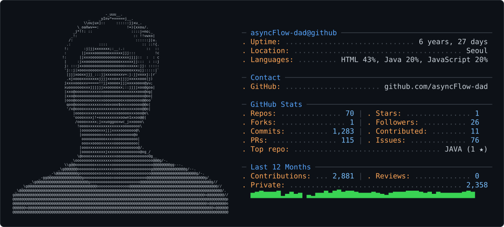

<picture>
  <source media="(prefers-color-scheme: dark)" srcset="dark_mode.svg" />
  <source media="(prefers-color-scheme: light)" srcset="light_mode.svg" />
  
</picture>

<!--  -->
<!--  -->

 
  
<!--  -->

 
  
<!--  -->

<!-- <h3 align="center"><b>🛠 Tech Stack 🛠</b></h3> -->

<!-- 
<h1>📚 Tech Stack</h1>

  -->

<!-- 

<h3>DB</h3>
  
  
  

   
  

  <h3>Language</h3>
  
  
  
  

   

<h3>
FrameWork
</h3>
  
   -->
  <!--   -->
  <!-- 

   -->
  <!-- 

  <h3>Css framework</h3>
  
  
  
  

   

  
  
  
  

    -->

  <!--  -->
  <!--   -->

  <!--  -->

